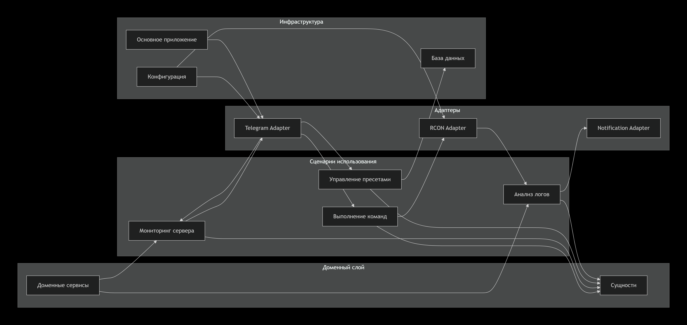

# Minecraft Server Admin Bot

---

## Обзор проекта

### Проблема
Администрирование Minecraft серверов требует постоянного доступа к консоли, выполнения рутинных операций и мониторинга производительности в реальном времени.

### Решение
Telegram-бот для удаленного управления сервером через RCON протокол с расширенными возможностями мониторинга и автоматизации.

### Ключевые преимущества
- 🚀 **Удаленное управление** - доступ к серверу из любого места
- 📊 **Централизованный мониторинг** - вся статистика в одном месте  
- ⚡ **Быстрые команды** - пресеты для рутинных операций
- 🔔 **Умные уведомления** - мгновенные оповещения о событиях
- 💾 **История метрик** - отслеживание производительности over time

---

## Архитектура системы

### Архитектура



---

## Пользовательский интерфейс

### Главное меню

```
🤖 Minecraft Admin Bot

🏠 Главное меню

📊 Статус сервера
⚡ Быстрые команды
📈 Мониторинг
🔔 Уведомления
❓ Помощь
```

### Статус сервера

```
📊 Статус сервера

🟢 Сервер: Online
👥 Игроки: 8/50
⚡ TPS: 19.8
💾 Память: 1.8/4.0 GB
⏰ Аптайм: 1д 12ч

[🔄 Обновить] [↩️ Назад]
```

### Быстрые команды

```
⚡ Быстрые команды

💾 save_all - Сохранить мир
🛑 stop - Остановить сервер
📋 list - Список игроков
⚡ performance - Статистика
🔁 reload - Перезагрузить

[↩️ Назад]
```

---

## План разработки

### Неделя 1: Базовый функционал (Дни 1-7)

#### День 1-2: Основа проекта

**Рома (TL)**
 - Настройка архитектуры проекта
 - Конфигурация приложения
 - Базовые Use Cases структуры
 - Unit-тесты

**Алёна (Dev1)**
 - RCON клиент для подключения к серверу
 - Базовые команды: list, say, stop
 - Обработка ошибок соединения

**Вика (Dev2)**
 - Настройка Telegram бота
 - Команды /start, /help, /cmd
 - Система аутентификации администраторов

**Стефа (Dev3)**
 - Domain модели: ServerStatus, CommandResult
 - Базовая валидация команд
 - Система логов приложения

**Результат:** Бот подключен к Telegram, может отправлять базовые команды на сервер

#### День 3-4: Интерфейс и мониторинг

**Рома (TL)**
 - Use Case выполнения команд
 - Use Case мониторинга сервера
 - Координация интеграции компонентов

**Алёна (Dev1)**
 - Парсинг TPS из RCON ответов
 - Мониторинг использования памяти
 - Статистика онлайн игроков

**Вика (Dev2)**
 - Главное меню с инлайн-кнопками
 - Команда /status с форматированием
 - Кнопки быстрого доступа

**Стефа (Dev3)**
 - Domain сервис MetricsCalculator
 - Модель для метрик производительности
 - SQLite база для хранения данных

**Результат:** Работающая система мониторинга с красивым интерфейсом

#### День 5-7: Пресеты команд

**Рома (TL)**
 - Use Case управления пресетами
 - Архитектура системы пресетов
 - Интеграция с существующими Use Cases

**Алёна (Dev1)**
 - CRUD операции для пресетов
 - Система параметризации команд
 - Выполнение пресетов последовательно

**Вика (Dev2)**
 - Интерфейс управления пресетами
 - Кнопки быстрых команд (save_all, restart)
 - Ввод параметров для пресетов

**Стефа (Dev3)**
 - Domain модель CommandPreset
 - Валидация пресетов команд
 - Миграции базы данных для пресетов

**Результат:** Полнофункциональный бот с мониторингом и пресетами

---

### Неделя 2: Продвинутые функции и релиз (Дни 8-14)

#### День 8-9: Уведомления и события

**Рома (TL)**
 - Use Case анализа логов
 - Система событий сервера
 - Конфигурация уведомлений

**Алёна (Dev1)**
 - Парсинг логов в реальном времени
 - Детектор событий: вход/выход игроков
 - Фильтрация значимых событий

**Вика (Dev2)**
 - Форматирование уведомлений
 - Настройка типов уведомлений
 - Система подписок на уведомления (Не платные, просто вкл\выкл)

**Стефа (Dev3)**
 - Domain сервис LogAnalyzer
 - Модели событий (PlayerJoin, ServerError)
 - Хранение конфигурации уведомлений

**Результат:** Умные уведомления о событиях сервера

#### День 10-11: Аналитика и отчеты

**Рома (TL)**
 - Use Case генерации отчетов
 - Система сбора метрик
 - Архитектура аналитики

**Алёна (Dev1)**
 - Сбор исторических данных
 - Агрегация метрик за периоды
 - Расчет трендов производительности

**Вика (Dev2)**
 - Команда /report с отчетами
 - Текстовые графики производительности
 - Экспорт статистики

**Стефа (Dev3)**
 - Domain сервис StatisticsCalculator
 - Модели отчетов и аналитики
 - Оптимизация запросов к БД

**Результат:** Система аналитики и отчетности

#### День 12-13: Полировка и стабилизация

**Рома (TL)**
 - Рефакторинг критических компонентов
 - Оптимизация производительности
 - Финальная интеграция всех модулей

**Алёна (Dev1)**
 - Обработка специфичных форматов ответов RCON
 - Тестирование на различных версиях Minecraft

**Вика (Dev2)**
 - Улучшение UX/UI интерфейса
 - Обработка ошибок пользовательского ввода
 - Документация пользовательских функций

**Стефа (Dev3)**
 - Исправление багов и стабилизация
 - Нагрузочное тестирование

**Результат:** Система аналитики и отчетности

#### День 14: Релиз ._.

**Рома (TL)**
 - Финальное тестирование всей системы
 - Деплой приложения
 - Релизная документация

**Алёна (Dev1)**
 - Инструкции по установке RCON

**Вика (Dev2)**
 - Пользовательская документация
 - Руководство по командам
 - Примеры использования

**Стефа (Dev3)**
 - Сборка релизной версии
 - Подготовка примеров конфигурации

**Результат:** Готовый к использованию продукт с документацией
